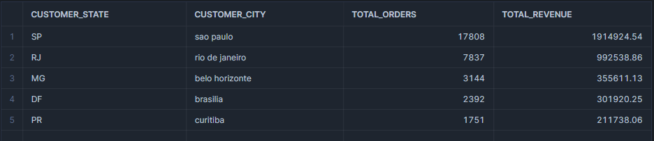

# SQL Project
SQL Ecommerce Data Analysis Project

Query: Top 5 Cities by Total Revenue (2016-2018)

Query Objective:
Identify the top-performing cities in Brazil in terms of total revenue and order volume to help focus business efforts on high-revenue regions.

Key Insights:

São Paulo (SP) leads with the highest revenue, making it a strategic city for marketing and logistics investments.
The top 5 cities contribute significantly to total revenue, indicating that e-commerce activity is concentrated in major urban centers.
Businesses can expand their operations and promotions in high-potential cities like Belo Horizonte and Brasília.

